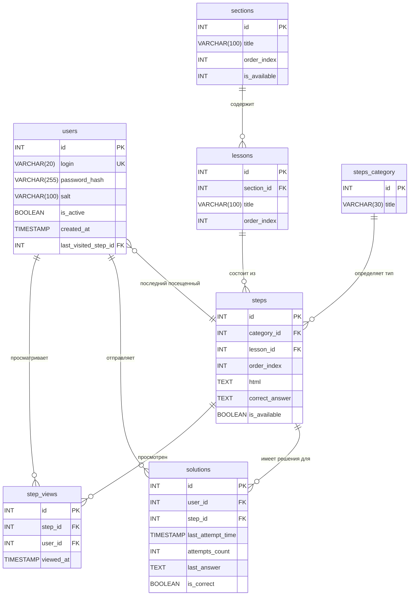

# DDL-команды для создания базы данных

База данных предназначена для хранения информации об уроках, пользователях и их решениях в онлайн-LMS (Learning Management System). База работает на СУБД MySQL.

## Содержание

- [Описание структуры данных](#описание-структуры-данных)
- [Пользователи (users)](#пользователи-users)
- [Разделы курса (sections)](#разделы-курса-sections)
- [Уроки (lessons)](#уроки-lessons)
- [Категории степов (steps_category)](#категории-степов-steps_category)
- [Степы (steps)](#степы-steps)
- [Решения пользователей (solutions)](#решения-пользователей-solutions)
- [Просмотры степов (step_views)](#просмотры-степов-step_views)
- [Триггеры](#триггеры)
- [ER-Диаграмма базы данных](#er-диаграмма-базы-данных)

## Описание структуры данных

Основные сущности БД:

### Пользователи (users)

Учетные записи пользователей системы.

**Атрибуты:**
- `id` - идентификатор
- `login` - имя пользователя (должно быть уникальным)
- `password_hash` - хэш пароля
- `salt` - соль для расшифровки хэша
- `is_active` - пометка, активный ли пользователь
- `created_at` - дата и время создания пользователя
- `last_visited_step_id` - id последнего посещенного степа. Поле используется для того, чтобы при каждом визите открывать для конкретного пользователя тот степ, на котором он остановился в прошлый раз

### Разделы курса (sections)

Все уроки объединены в разделы.

**Атрибуты:**
- `id` - идентификатор
- `title` - название раздела
- `order_index` - порядковый номер для сортировки при отображении в меню LMS
- `is_available` - пометка, доступен ли раздел для всех пользователей (1) или только для админа (0)

### Уроки (lessons)

**Атрибуты:**
- `id` - идентификатор
- `section_id` - внешний ключ - id раздела, к которому относится урок
- `title` - название урока
- `order_index` - порядковый номер для сортировки при отображении в меню LMS

### Категории степов (steps_category)

Каждый урок включает в себя короткие разделы - шаги, или степы. В зависимости от их категории (теоретические шаги, шаги с загрузкой csv в качестве ответа и т.д.) изменяется форма для ответов учеников.

**Атрибуты:**
- `id` - идентификатор
- `title` - название категории

### Степы (steps)

**Атрибуты:**
- `id` - идентификатор
- `category_id` - внешний ключ (категория степа)
- `lesson_id` - внешний ключ (к какому уроку относится степ)
- `order_index` - порядковый номер (для сортировки внутри урока)
- `html` - исходный html-код контента
- `correct_answer` - правильный ответ на степ (заполняется, если степ подразумевает ответ)
- `is_available` - если недоступен (0), для пользователя будет заблокирована возможность ответа

### Решения пользователей (solutions)

Для каждого сочетания пользователь-степ возможно только одна запись. Если один и тот же пользователь ответил несколько раз на один и тот же степ, то решение перезаписывается.

**Атрибуты:**
- `id` - идентификатор
- `user_id` - внешний ключ на id пользователя
- `step_id` - внешний ключ, к какому степу относится решение
- `last_attempt_time` - время последней попытки решения
- `attempts_count` - количество попыток
- `last_answer` - последний ответ пользователя. История ответов не хранится для экономии памяти
- `is_correct` - пометка, правильный ли ответ

### Просмотры степов (step_views)

Отметка о том, что конкретный пользователь уже посмотрел этот степ (для пометки степа в интерфейсе). Для каждого сочетания пользователь-степ возможна только одна запись.

**Атрибуты:**
- `id` - идентификатор
- `step_id` - внешний ключ на таблицу steps
- `user_id` - внешний ключ на таблицу users
- `viewed_at` - отметка о времени просмотра

### Триггеры

Созданы триггеры, работающие при вставке или обновлении записи в таблице solutions.

Если step принадлежит категории 1 (step_category = 1), то есть это теоретический шаг, автоматически устанавливать значение is_correct в FALSE, независимо от того, какое значение пытались установить. Это сделано для того, чтобы избежать лишних баллов за теоретическое задание, за которое баллы не должны выставляться.

## 📊 ER-Диаграмма базы данных

